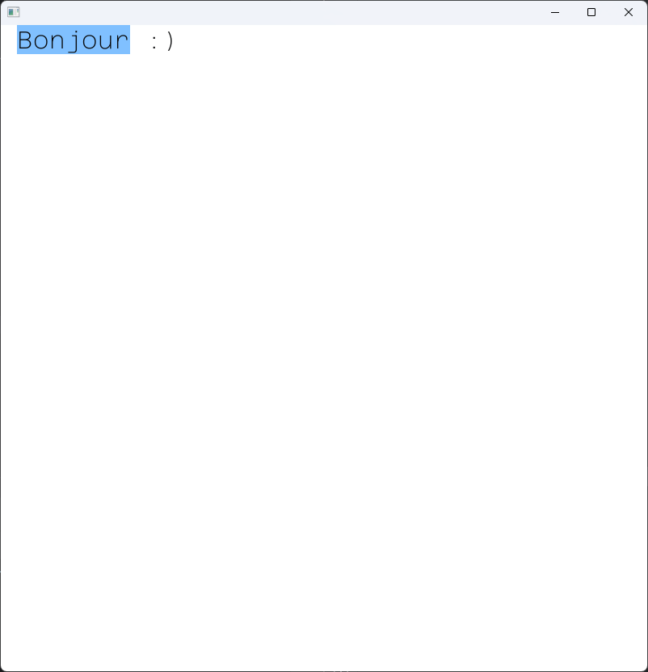

# Éditeur de texte (OMD-TP2)

## Description

Ce projet est un éditeur de texte **ascii** basique, implémentant des commandes de base :
- déplacement (flèches)
- sélection (shift + flèches)
- copier (ctrl c)
- couper (ctrl x)
- coller (ctrl v)
- zoom / dézoom (ctrl + / ctrl -)

La version 2 obtient ces ajouts:
- L'historique des actions avec fonction de rewind (ctrl z)
- 
-
-
-

⚠️ Comme mentionné précedemment, seuls les caractères ascii sont supportés, il se peut de ce fait que tous vos caractères ne soient pas affichés correctement.

## Build et tests

### Windows

Les outils nécessaires sont : 
- MSVC C++ (Visual Studio)
- CMake

#### Pour génerer le projet
```
cmake -S . -B ./build
```

#### Pour build
```
cd ./build
cmake --build .
```

#### Pour lancer les tests
```
cd ./build
ctest build -C Debug --output-on-failure
```

### Linux

Pas supporté :(

### macOS

Pas supporté :(